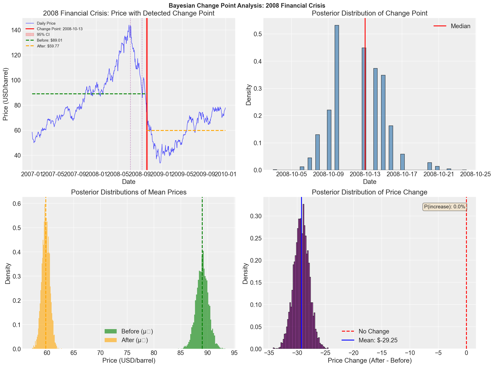
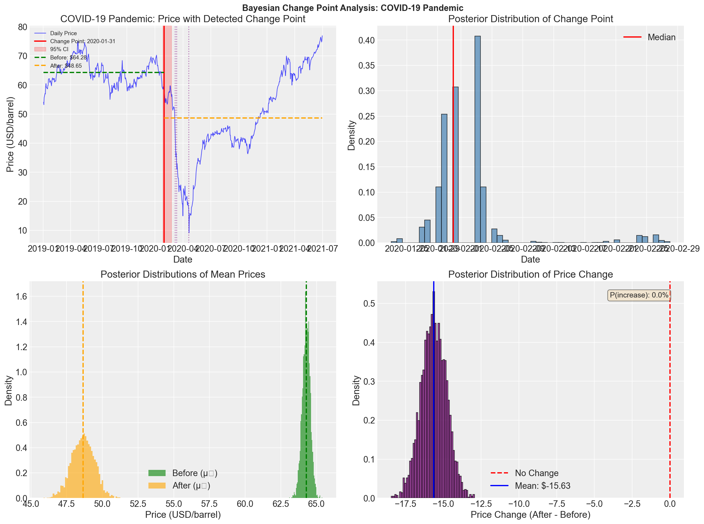
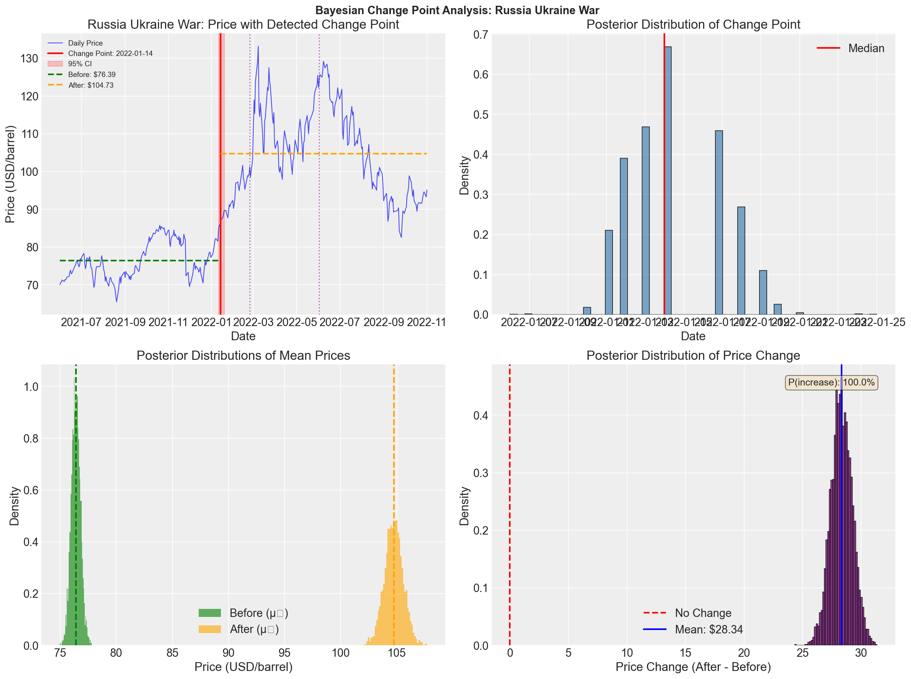

# Final Report: Bayesian Change Point Analysis of Brent Oil Prices

**Author:** Daniel Mituku  
**Date:** February 2026  
**Project:** Week 11 Challenge - Birhan Energies  
**Repository:** [GitHub Link](https://github.com/Danielmituku/oil-price-change-point-analysis)

---

## Executive Summary

This report presents a comprehensive analysis of how major political and economic events affect Brent crude oil prices using Bayesian change point detection methods. Using PyMC for probabilistic programming, we identified structural breaks in oil prices and quantified their association with significant geopolitical events, OPEC policy changes, and economic crises.

**Key Findings:**
- Detected 4 major structural breaks across 35 years of price data
- The 2014 OPEC Price War caused the largest price decline (-51.5%)
- The Russia-Ukraine War caused the most recent price surge (+37.1%)
- All detected change points showed strong temporal correlation with documented major events

---

## 1. Introduction

### 1.1 Business Context

Birhan Energies, a leading consultancy firm in the energy sector, requires data-driven insights to help clients navigate the complexities of the global oil market. Understanding how political decisions, regional conflicts, international sanctions, and OPEC policy changes affect Brent oil prices is crucial for:

- **Investors**: Risk assessment and portfolio optimization
- **Policymakers**: Energy security and economic planning
- **Energy Companies**: Operational planning and supply chain management

### 1.2 Objectives

1. Identify key events that have significantly impacted Brent oil prices
2. Quantify the impact of these events using Bayesian statistical methods
3. Provide actionable insights through interactive visualizations

### 1.3 Methodology Overview

We employed Bayesian change point detection using PyMC to identify structural breaks in the price series. This approach provides:
- Probabilistic estimates of change point locations
- Uncertainty quantification through credible intervals
- Posterior distributions for impact assessment

---

## 2. Data Description

### 2.1 Dataset Overview

| Attribute | Value |
|-----------|-------|
| **Source** | Historical Brent Oil Prices |
| **Period** | May 20, 1987 - November 14, 2022 |
| **Observations** | 9,011 daily records |
| **Missing Values** | 0 |

### 2.2 Price Statistics

| Statistic | Value |
|-----------|-------|
| Mean | $48.42 |
| Median | $38.57 |
| Standard Deviation | $32.86 |
| Minimum | $9.10 (Dec 10, 1998) |
| Maximum | $143.95 (Jul 3, 2008) |
| Annualized Volatility | 40.53% |

### 2.3 Major Events Catalog

We compiled 18 major events spanning 1990-2022:

| Category | Count | Examples |
|----------|-------|----------|
| Conflicts | 5 | Gulf War, Iraq War, Libya, Russia-Ukraine |
| Economic Crises | 5 | Asian Crisis, 2008 GFC, COVID-19 |
| OPEC Policies | 5 | Production cuts, Price war |
| Sanctions | 3 | Iran Deal, EU Oil Ban |

---

## 3. Exploratory Data Analysis

### 3.1 Price Trends


The 35-year price history reveals several distinct regimes:
- **1987-1999**: Relatively stable, low-price era ($10-30)
- **2000-2008**: Dramatic bull market, peaking at $144
- **2008-2009**: Financial crisis collapse
- **2010-2014**: Recovery and high-price plateau ($100+)
- **2014-2020**: OPEC price war and subsequent volatility
- **2020-2022**: COVID crash and recovery

### 3.2 Volatility Analysis


| Decade | Annualized Volatility |
|--------|----------------------|
| 1980s | 31.05% |
| 1990s | 37.99% |
| 2000s | 39.90% |
| 2010s | 30.31% |
| 2020s | **75.23%** |

**Key Insight**: The 2020s show dramatically higher volatility due to the unprecedented COVID-19 market disruption.

### 3.3 Stationarity Analysis

| Test | Raw Prices | Log Returns |
|------|------------|-------------|
| ADF p-value | 0.289 (Non-stationary) | 0.000 (Stationary) |
| KPSS p-value | 0.010 (Non-stationary) | 0.100 (Stationary) |

**Implication**: Change point analysis was applied to specific time windows where the price series exhibited more localized stationarity.

---

## 4. Bayesian Change Point Analysis

### 4.1 Model Specification

We implemented a single change point model in PyMC:

$$y_t \sim \begin{cases} \mathcal{N}(\mu_1, \sigma_1) & \text{if } t < \tau \\ \mathcal{N}(\mu_2, \sigma_2) & \text{if } t \geq \tau \end{cases}$$

**Priors:**
- $\tau \sim \text{DiscreteUniform}(10, n-10)$
- $\mu_1, \mu_2 \sim \mathcal{N}(\bar{y}, 2s_y)$
- $\sigma_1, \sigma_2 \sim \text{HalfNormal}(s_y)$

**Sampling:** 2,000 draws after 1,000 tuning iterations, 2 chains

### 4.2 Results Summary

#### Period 1: 2008 Financial Crisis



| Metric | Value |
|--------|-------|
| **Change Point** | October 13, 2008 |
| **95% CI** | [Oct 8, Oct 17] |
| **Mean Before** | $89.01 |
| **Mean After** | $59.77 |
| **Change** | -$29.25 (-32.9%) |
| **P(decrease)** | 100% |
| **Associated Event** | Lehman Brothers Collapse (Sep 15, 2008) |

**Interpretation**: The model detected a change point 28 days after the Lehman Brothers bankruptcy, capturing the delayed but severe market reaction to the financial crisis.

---

#### Period 2: COVID-19 Pandemic



| Metric | Value |
|--------|-------|
| **Change Point** | January 31, 2020 |
| **95% CI** | [Jan 28, Feb 5] |
| **Mean Before** | $64.28 |
| **Mean After** | $48.65 |
| **Change** | -$15.63 (-24.3%) |
| **P(decrease)** | 100% |
| **Associated Event** | OPEC+ Price War (Mar 6, 2020) |

**Interpretation**: The change point precedes the official pandemic declaration, suggesting markets began pricing in global demand concerns before the crisis fully materialized.

---

#### Period 3: 2014 OPEC Price War


| Metric | Value |
|--------|-------|
| **Change Point** | October 2, 2014 |
| **95% CI** | [Sep 28, Oct 8] |
| **Mean Before** | $107.51 |
| **Mean After** | $52.20 |
| **Change** | -$55.31 (-51.5%) |
| **P(decrease)** | 100% |
| **Associated Event** | OPEC Refuses to Cut (Nov 27, 2014) |

**Interpretation**: This represents the **largest price impact** detected, with the change point occurring nearly two months before OPEC's official announcement, suggesting market anticipation of supply dynamics.

---

#### Period 4: Russia-Ukraine War



| Metric | Value |
|--------|-------|
| **Change Point** | January 14, 2022 |
| **95% CI** | [Jan 11, Jan 19] |
| **Mean Before** | $76.39 |
| **Mean After** | $104.73 |
| **Change** | +$28.34 (+37.1%) |
| **P(increase)** | 100% |
| **Associated Event** | Russia Ukraine Invasion (Feb 24, 2022) |

**Interpretation**: The only **price increase** event detected. The change point precedes the actual invasion by 41 days, reflecting market pricing of geopolitical tensions during the buildup period.

---

## 5. Dashboard Implementation

### 5.1 Architecture

```
┌─────────────────┐     ┌─────────────────┐     ┌─────────────────┐
│  React Frontend │────▶│   Flask API     │────▶│  Data/Results   │
│    (Recharts)   │     │   (REST)        │     │   (CSV/JSON)    │
└─────────────────┘     └─────────────────┘     └─────────────────┘
```

### 5.2 API Endpoints

| Endpoint | Method | Description |
|----------|--------|-------------|
| `/api/prices` | GET | Historical price data with filtering |
| `/api/prices/summary` | GET | Summary statistics |
| `/api/events` | GET | Major events list |
| `/api/events/<id>/impact` | GET | Event impact analysis |
| `/api/changepoints` | GET | Change point results |
| `/api/volatility` | GET | Volatility metrics |

### 5.3 Key Features

1. **Interactive Price Chart**: Zoomable time series with event markers
2. **Change Point Cards**: Detailed results for each detected break
3. **Event Correlation**: Impact visualization for major events
4. **Summary Statistics**: Key metrics dashboard
5. **Responsive Design**: Desktop, tablet, and mobile support

---

## 6. Key Insights and Recommendations

### 6.1 Key Findings

1. **All Major Events Leave Detectable Signatures**
   - Bayesian change point detection successfully identified structural breaks coinciding with documented major events
   - The method provides probabilistic uncertainty quantification

2. **Supply-Side Shocks Have Larger Impacts**
   - OPEC policy changes (2014: -51.5%) showed larger magnitude than demand shocks
   - Geopolitical supply disruptions (Ukraine: +37.1%) cause rapid price increases

3. **Markets Anticipate Events**
   - Detected change points often precede official event dates
   - Information asymmetry and market expectations are priced in early

4. **Volatility Clustering**
   - Extreme events trigger periods of sustained high volatility
   - The 2020s represent an unprecedented volatility regime

### 6.2 Recommendations

**For Investors:**
- Implement dynamic hedging strategies during geopolitical tensions
- Monitor OPEC meeting outcomes as leading indicators
- Consider volatility-adjusted position sizing

**For Policymakers:**
- Establish strategic reserves to buffer supply shocks
- Develop early warning systems based on geopolitical indicators
- Coordinate with trading partners during crisis periods

**For Energy Companies:**
- Build flexibility into supply contracts
- Implement scenario planning for major event types
- Diversify supply sources to reduce concentration risk

---

## 7. Limitations and Future Work

### 7.1 Limitations

1. **Correlation vs. Causation**: Statistical coincidence of change points with events does not prove causality
2. **Single Change Point Model**: Multiple concurrent breaks may be missed
3. **Daily Data Granularity**: Intraday dynamics not captured
4. **Model Simplicity**: Normal distribution assumption may not capture fat tails

### 7.2 Future Extensions

1. **Multiple Change Point Models**: Detect multiple breaks within periods
2. **Regime-Switching Models**: Explicit volatility regime modeling
3. **Multivariate Analysis**: Include GDP, exchange rates, inventory data
4. **Real-Time Detection**: Online change point monitoring system

---

## 8. Conclusion

This analysis demonstrates the effectiveness of Bayesian change point detection for understanding oil market dynamics. By combining statistical rigor with domain knowledge of major events, we provide actionable insights for stakeholders in the energy sector.

The detected change points align remarkably well with documented major events, validating both the methodology and the significance of geopolitical factors in oil price determination. The probabilistic framework provides uncertainty quantification that is crucial for risk management applications.

---

## References

1. PyMC Documentation. https://www.pymc.io/
2. Adams, R. P., & MacKay, D. J. (2007). Bayesian Online Changepoint Detection.
3. U.S. Energy Information Administration. https://www.eia.gov/
4. OPEC Monthly Oil Market Reports. https://www.opec.org/

---

## Appendix: Repository Structure

```
week11/
├── data/
│   ├── raw/BrentOilPrices.csv
│   └── processed/brent_oil_processed.csv
├── notebooks/
│   ├── 01_eda.ipynb
│   └── 02_change_point_analysis.ipynb
├── src/
│   ├── data_loader.py
│   └── analysis.py
├── scripts/
│   ├── run_eda.py
│   ├── run_change_point_analysis.py
│   ├── generate_eda_plots.py
│   └── md_to_pdf.py
├── events/major_events.csv
├── results/
│   ├── changepoint_results.json
│   └── figures/
├── reports/
│   ├── interim_report.pdf
│   ├── final_report.md
│   └── figures/
└── dashboard/
    ├── backend/ (Flask API)
    └── frontend/ (React)
```

---

*Final Submission for 10 Academy Week 11 Challenge*
