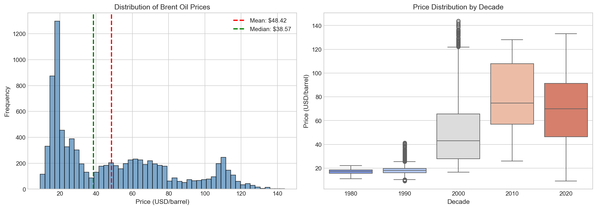
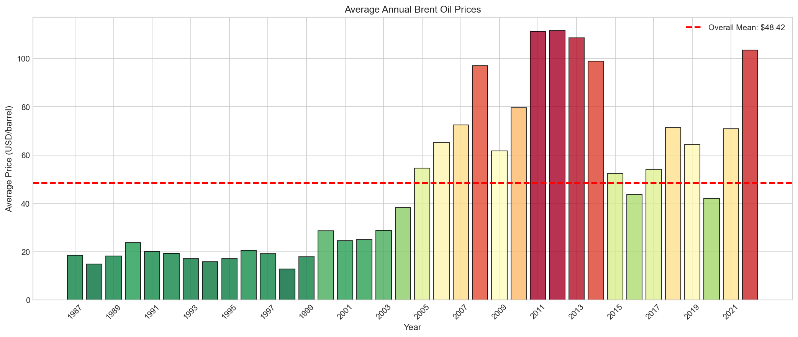
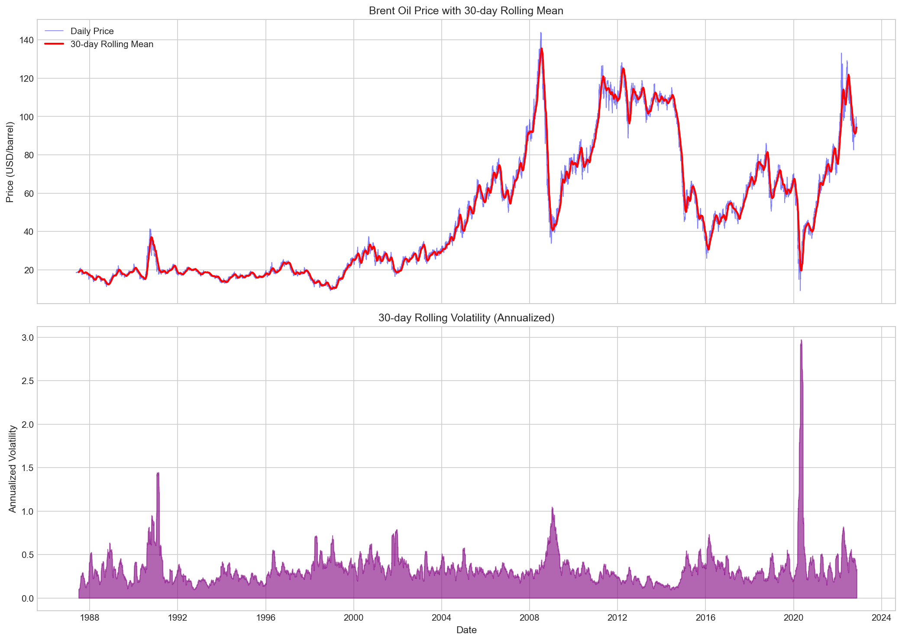
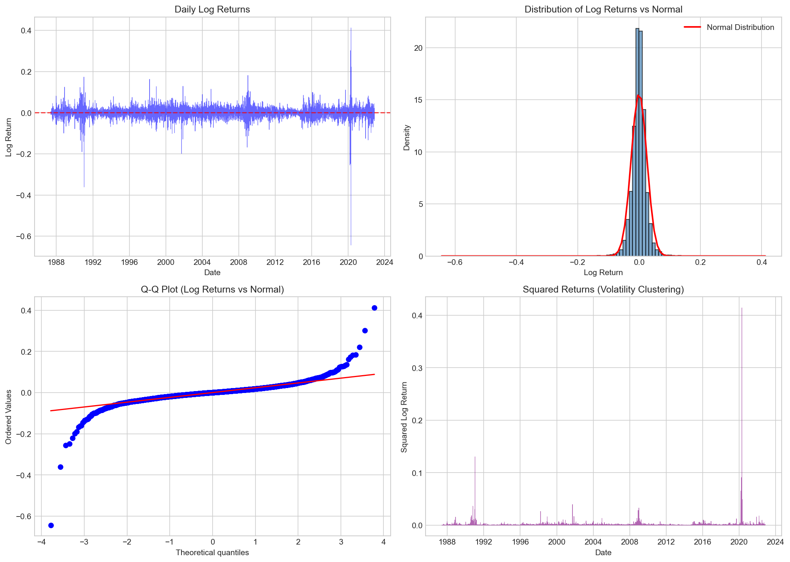
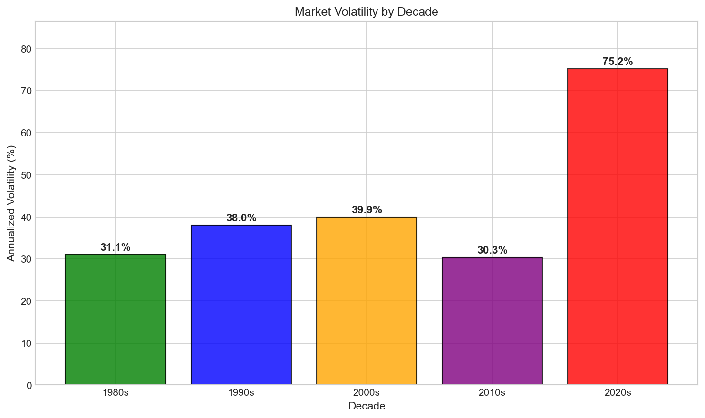
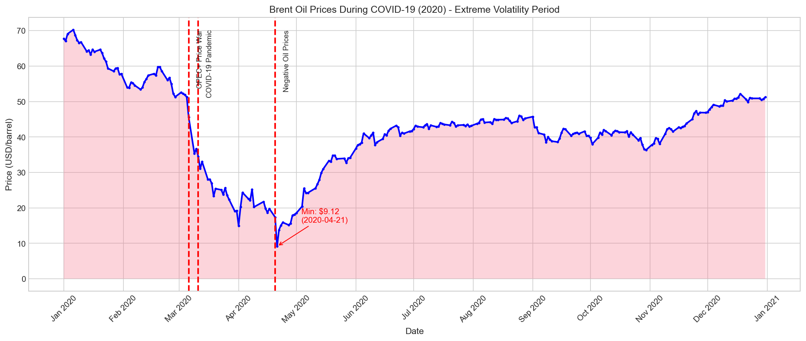
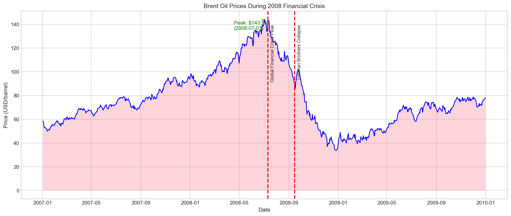

# Interim Report: Change Point Analysis of Brent Oil Prices

**Author:** Daniel Mituku  
**Date:** February 2026  
**Project:** Week 11 Challenge - Birhan Energies

---

## Executive Summary

This interim report presents the foundational work for analyzing how major political and economic events affect Brent oil prices using Bayesian change point detection methods. The analysis aims to identify structural breaks in oil prices and associate them with significant geopolitical events, OPEC policy changes, and economic crises.

---

## 1. Analysis Workflow

### 1.1 Data Acquisition and Preparation
1. Load historical Brent oil price data (May 1987 - November 2022)
2. Handle mixed date formats and data quality issues
3. Compute derived features (log returns, rolling statistics)
4. Merge with major events dataset

### 1.2 Exploratory Data Analysis
1. Visualize price trends and volatility patterns
2. Test for stationarity (ADF, KPSS tests)
3. Analyze return distributions
4. Identify potential structural breaks visually

### 1.3 Bayesian Change Point Modeling
1. Define PyMC model with discrete change point prior
2. Specify likelihood function with switch mechanism
3. Run MCMC sampling with convergence checks
4. Extract posterior distributions for change points

### 1.4 Results Interpretation
1. Identify most probable change point dates
2. Quantify parameter changes (mean, volatility)
3. Associate detected changes with documented events
4. Calculate impact percentages and confidence intervals

### 1.5 Communication
1. Create interactive dashboard (Flask + React)
2. Generate visualizations for stakeholders
3. Write comprehensive final report

---

## 2. Major Events Dataset

We have compiled 18 major events that potentially impacted Brent oil prices between 1987-2022:

| Event | Date | Type | Expected Impact |
|-------|------|------|-----------------|
| Gulf War Invasion | 1990-08-02 | Conflict | Price Increase |
| Asian Financial Crisis | 1997-07-02 | Economic Crisis | Price Decrease |
| OPEC Production Cuts | 1999-03-23 | OPEC Policy | Price Increase |
| September 11 Attacks | 2001-09-11 | Geopolitical | Price Decrease |
| Iraq War Begins | 2003-03-20 | Conflict | Price Increase |
| Global Financial Crisis Peak | 2008-07-11 | Economic Crisis | Price Decrease |
| Lehman Brothers Collapse | 2008-09-15 | Economic Crisis | Price Decrease |
| Arab Spring Libya | 2011-02-15 | Conflict | Price Increase |
| ISIS Captures Mosul | 2014-06-20 | Conflict | Price Increase |
| OPEC Refuses to Cut | 2014-11-27 | OPEC Policy | Price Decrease |
| Iran Nuclear Deal | 2015-07-14 | Sanctions | Price Decrease |
| OPEC Production Agreement | 2016-11-30 | OPEC Policy | Price Increase |
| US Withdraws Iran Deal | 2018-05-08 | Sanctions | Price Increase |
| OPEC+ Price War | 2020-03-06 | OPEC Policy | Price Decrease |
| COVID-19 Pandemic | 2020-03-11 | Economic Crisis | Price Decrease |
| Negative Oil Prices | 2020-04-20 | Economic Crisis | Price Decrease |
| Russia Ukraine Invasion | 2022-02-24 | Conflict | Price Increase |
| EU Russian Oil Ban | 2022-06-02 | Sanctions | Price Increase |

---

## 3. Initial EDA Findings

### 3.1 Data Overview

| Metric | Value |
|--------|-------|
| **Total Observations** | 9,011 daily records |
| **Date Range** | May 20, 1987 to November 14, 2022 |
| **Trading Days** | 12,962 calendar days |
| **Missing Values** | 0 |

### 3.2 Price Time Series with Major Events

The figure below shows the complete Brent oil price series from 1987 to 2022, with vertical lines marking major events color-coded by type (Conflict, OPEC Policy, Economic Crisis, Sanctions, Geopolitical).


**Key Observations:**
- Clear structural breaks visible around major events
- Gulf War (1990), 2008 Financial Crisis, 2014 OPEC price war, and COVID-19 (2020) show dramatic price changes
- Long-term upward trend from ~$20 to $100+ with significant volatility

### 3.3 Price Statistics

| Statistic | Value |
|-----------|-------|
| Mean Price | $48.42 |
| Median Price | $38.57 |
| Standard Deviation | $32.86 |
| Minimum Price | $9.10 (December 10, 1998) |
| Maximum Price | $143.95 (July 3, 2008) |
| Price Range | $134.85 |

### 3.4 Price Distribution Analysis



**Key Observations:**
- Right-skewed distribution with most prices below $60
- Mean ($48.42) higher than median ($38.57) indicates positive skew
- Significant evolution across decades: 1980s-1990s concentrated below $30, 2000s-2010s spread to $100+

### 3.5 Yearly Average Prices



**Key Observations:**
- Dramatic price increase from 2003-2008 (Iraq War, economic growth)
- Peak in 2008, 2011-2013 period with prices above $100
- Sharp decline in 2014-2016 (OPEC price war)
- COVID-19 impact visible in 2020 low

### 3.6 Rolling Statistics (Mean and Volatility)



**Key Observations:**
- Rolling mean tracks price trends smoothly
- Volatility spikes correspond to major events
- 2008 and 2020 show extreme volatility periods
- Volatility tends to cluster (high volatility followed by high volatility)

### 3.7 Log Returns Analysis



**Key Statistical Properties:**

| Statistic | Value |
|-----------|-------|
| Mean Daily Log Return | 0.0179% |
| Standard Deviation | 2.5532% |
| Annualized Volatility | 40.53% |
| Skewness | -1.7444 |
| Kurtosis | 65.9047 |

**Key Observations:**
- **Negative Skewness**: Large negative price shocks more common than positive ones
- **Extreme Kurtosis (65.9)**: Fat tails - much higher probability of extreme events than normal distribution
- **Q-Q Plot**: Clear deviation from normality in tails
- **Volatility Clustering**: Squared returns show periods of high/low activity

### 3.8 Stationarity Test Results

#### Raw Prices (Non-Stationary)
| Test | Statistic | P-Value | Conclusion |
|------|-----------|---------|------------|
| ADF | -1.9939 | 0.2893 | Non-stationary |
| KPSS | 9.5588 | 0.0100 | Non-stationary |

#### Log Returns (Stationary)
| Test | Statistic | P-Value | Conclusion |
|------|-----------|---------|------------|
| ADF | -16.4271 | 0.0000 | Stationary |
| KPSS | 0.0343 | 0.1000 | Stationary |

**Implication**: Change point models should be applied to log returns or prices within specific time windows for valid statistical inference.

### 3.9 Volatility by Decade



| Decade | Annualized Volatility |
|--------|----------------------|
| 1980s | 31.05% |
| 1990s | 37.99% |
| 2000s | 39.90% |
| 2010s | 30.31% |
| 2020s | **75.23%** |

**Key Finding**: The 2020s show dramatically higher volatility (75.23%) due to the COVID-19 pandemic and subsequent market disruptions - more than double any other decade.

### 3.10 COVID-19 Period Analysis (2020)



**Extreme Events During COVID-19:**

| Date | Event | Impact |
|------|-------|--------|
| March 6, 2020 | OPEC+ Price War | -25% weekly |
| March 11, 2020 | WHO Pandemic Declaration | Continued decline |
| April 20, 2020 | Negative WTI Prices | Historic low |
| April 21, 2020 | **Largest Single-Day Drop** | **-64.37%** |
| April 22, 2020 | **Largest Single-Day Gain** | **+41.20%** |

### 3.11 2008 Financial Crisis Analysis



**Key Observations:**
- Price peaked at $143.95 on July 3, 2008 (all-time high)
- Lehman Brothers collapse (September 15, 2008) triggered rapid decline
- Price dropped from ~$140 to ~$34 in 5 months (76% decline)
- Recovery began in early 2009

---

## 4. Assumptions and Limitations

### 4.1 Assumptions

1. **Data Quality**: Brent oil price data is accurate and reliable
2. **Event Dating**: Event dates represent the announcement/occurrence timing
3. **Market Efficiency**: Prices reflect available information with some delay
4. **Model Structure**: Simple change point models capture key dynamics

### 4.2 Limitations

#### Correlation vs. Causation
**Critical Disclaimer**: Detecting a statistical change point coinciding temporally with an event does NOT prove that the event caused the change. Multiple factors influence oil prices simultaneously, and:
- Events may be anticipated by markets before official dates
- Multiple events may occur in close proximity
- Confounding factors may not be captured in the model
- Reverse causality or third-variable explanations are possible

#### Model Constraints
- Single change point models may miss multiple concurrent breaks
- Simple mean-shift models may not capture volatility changes
- Daily data may mask intra-day dynamics
- Historical relationships may not hold for future predictions

#### Data Constraints
- Limited to publicly available price data
- Market microstructure effects not captured
- Sentiment and expectation effects not directly modeled

---

## 5. Repository Structure

```
week11/
├── data/
│   ├── raw/
│   │   └── BrentOilPrices.csv    # Raw price data (9,011 records)
│   └── processed/
│       └── brent_oil_processed.csv  # Processed with derived features
├── notebooks/
│   ├── 01_eda.ipynb              # Exploratory analysis notebook
│   └── 02_change_point_analysis.ipynb  # Bayesian modeling
├── src/
│   ├── __init__.py
│   ├── data_loader.py            # Data loading utilities
│   └── analysis.py               # Analysis functions
├── events/
│   └── major_events.csv          # 18 key events dataset
├── reports/
│   ├── interim_report.md         # This report
│   ├── figures/                  # EDA visualizations
│   └── final_report.md           # Final submission
├── scripts/
│   ├── download_data.py          # Data preparation
│   ├── run_eda.py                # EDA statistics
│   └── generate_eda_plots.py     # Visualization generation
├── docs/
│   └── analysis_workflow.md      # Workflow documentation
└── dashboard/
    ├── backend/                  # Flask API (Task 3)
    └── frontend/                 # React frontend (Task 3)
```

---

## 6. Next Steps

1. ~~Complete EDA~~: ✅ Finalized exploratory analysis with visualizations
2. **Implement PyMC Model**: Build and validate Bayesian change point detection
3. **Run Analysis**: Apply model to multiple time periods around key events
4. **Quantify Impacts**: Generate probabilistic statements about price changes
5. **Build Dashboard**: Develop Flask backend and React frontend
6. **Final Report**: Compile comprehensive findings and recommendations

---

## 7. References

1. PyMC Documentation: https://www.pymc.io/
2. Bayesian Changepoint Detection: https://docs.pymc.io/
3. Change Point Detection Methods: https://forecastegy.com/posts/change-point-detection-time-series-python/
4. MCMC Methods: https://towardsdatascience.com/monte-carlo-markov-chain-mcmc-explained-94e3a6c8de11
5. U.S. Energy Information Administration: https://www.eia.gov/

---

*Submitted for 10 Academy Week 11 Challenge - Interim Deadline*
